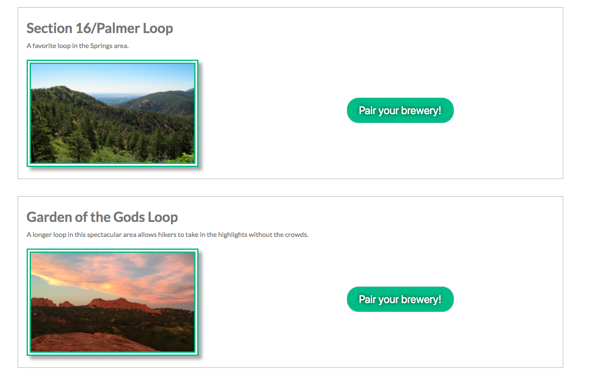

## Hikes To Hops Description

Hikes to Hops is an app that searches for local trails and will pair your trail of choice with a nearby brewery for your victory lap!  

## Link To Deployed App

- You can view the live app at https://hikes-to-hops.herokuapp.com/ 

## Tech Stack

* Front End: HTML5, CSS3, jQuery.
* APIs Used: Google Map's Geolocation API, the Hiking Project API, and the BreweryDB API.

## Screenshots 

- Header 

- Trails View 

- Modal View / Brewery Pair

